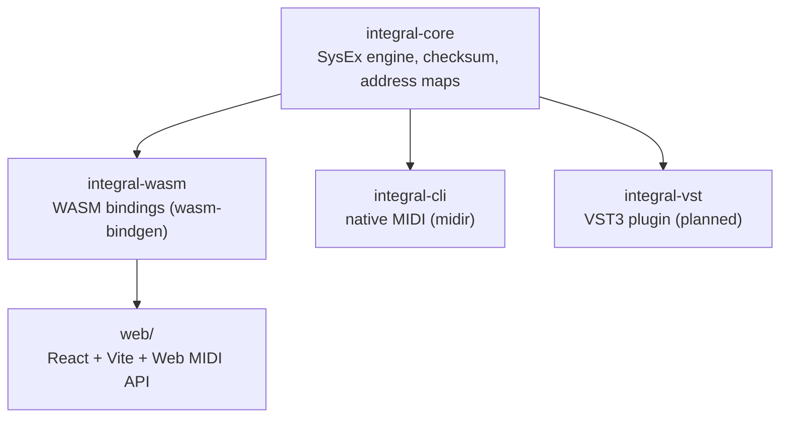

# Integral — Integra-7 Control Surface

A cross-platform, open-source control surface for the Roland INTEGRA-7
Synthesizer Module. All SysEx protocol logic lives in a shared Rust core
that compiles to both native and WebAssembly.

## Targets

- **Web** — React app powered by the Rust core via WASM, using the Web MIDI API
- **CLI** — Native command-line tools for device communication
- **VST3** — DAW plugin via nih-plug (planned)

## Quick Start

```bash
nix develop          # enter the dev shell (direnv does this automatically)
just check           # fmt, lint, build (native + WASM), test
just ping            # verify the Integra-7 is reachable
just dev-web         # start the web dev server (requires `just pack-wasm` first)
```

## Project Structure

| Path | Description |
|------|-------------|
| `crates/integral-core/` | Portable Rust library: SysEx engine, checksum, address maps |
| `crates/integral-wasm/` | WASM bindings (wasm-bindgen) for the web frontend |
| `crates/integral-cli/` | CLI tools: `integral ping` for device connectivity |
| `crates/integral-vst/` | VST3 wrapper via nih-plug (planned) |
| `web/` | React + TypeScript frontend (Vite) |
| `docs/midi/` | INTEGRA-7 MIDI Implementation reference (extracted from official PDF) |

## Just Targets

Run `just` for the full list. Key targets:

| Target | Description |
|--------|-------------|
| `just fmt` | Format all code (Rust + Nix) |
| `just check` | Full pre-commit gate: fmt, lint, build, WASM, test |
| `just ping` | Ping the Integra-7 via SysEx Identity Request |
| `just pack-wasm` | Build the WASM package for the web app |
| `just dev-web` | Start the Vite dev server |
| `just build-web` | Production web build (includes WASM pack) |

## Architecture



## License

[MIT](LICENSE)
