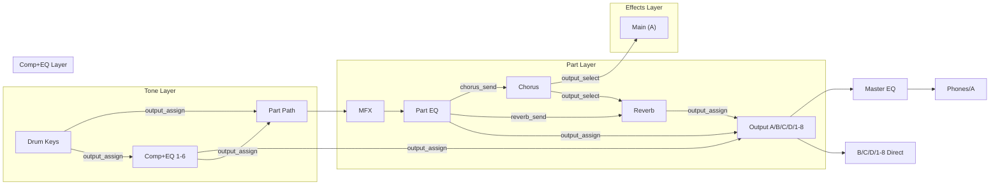

# Output Routing View — Design

## Problem

The INTEGRA-7 has a complex multi-layer output routing system. Currently,
routing controls are scattered across 5 different UI surfaces (mixer, FX strips,
drum editors, Comp+EQ strips). Part Output Assign (A/B/C/D/1-8) isn't surfaced
at all. Users can't see the full signal flow in one place.

## Signal Flow



## Design: Routing Page (new tab)

Add a **Routing** tab between Surround and Tone Edit. The page has three
horizontal sections stacked vertically:

### Section 1: Part Routing Matrix

A 16-column grid (one per part) showing the routing summary for each part:

```
┌──────┬──────┬──────┬──────┬──────┬─── ... ──┬──────┐
│  P1  │  P2  │  P3  │  P4  │  P5  │          │ P16  │
├──────┼──────┼──────┼──────┼──────┼─── ... ──┼──────┤
│ SN-A │PCM-S │PCM-D │ SN-S │PCM-S │          │ GM2  │
│Piano │Strng │Kit   │Lead  │Pad   │          │Bass  │
├──────┼──────┼──────┼──────┼──────┼─── ... ──┼──────┤
│[A ▾] │[A ▾] │[A ▾] │[B ▾] │[A ▾] │          │[A ▾] │  ← Output Assign dropdown
├──────┼──────┼──────┼──────┼──────┼─── ... ──┼──────┤
│FX1:64│FX1:80│FX1: 0│FX1:50│FX1:90│          │FX1: 0│  ← Chorus send level
│FX2:80│FX2:60│FX2: 0│FX2:40│FX2:70│          │FX2: 0│  ← Reverb send level
└──────┴──────┴──────┴──────┴──────┴─── ... ──┴──────┘
```

Each column is compact (~70px). The output assign dropdown is the primary new
control. Send levels are shown as small indicators (not full knobs — those are
already in the mixer).

### Section 2: Effects Routing

Horizontal bar showing Chorus and Reverb destinations:

```
┌─────────────────────────────────┬─────────────────────────────────┐
│ CHORUS                          │ REVERB                          │
│ Type: Chorus1    Out: [MAIN ▾]  │ Type: Hall1      Out: [A    ▾]  │
└─────────────────────────────────┴─────────────────────────────────┘
```

### Section 3: Drum Comp+EQ Routing (conditional)

Only visible when Comp+EQ is enabled. Shows the assignment part, then a grid
of the 6 units with their output destinations:

```
┌─ Drum Comp+EQ (Part 10) ──────────────────────────────────────────┐
│                                                                    │
│  C+EQ1     C+EQ2     C+EQ3     C+EQ4     C+EQ5     C+EQ6        │
│ [PART ▾]  [A    ▾]  [B    ▾]  [PART ▾]  [PART ▾]  [PART ▾]     │
│                                                                    │
│  Key Map:  ■■■■■■□□□□□□■■■■■■□□□□□□■■■□□□□□□□□□□□□□□□□□□□□□□□□  │
│            C1        C2        C3        C4        C5             │
│  Legend: ■=C+EQ1 ■=C+EQ2 ■=C+EQ3 □=PART                         │
└────────────────────────────────────────────────────────────────────┘
```

The key map is a horizontal piano-style strip (keys 21–108) where each key is
color-coded by its output assign destination. Clicking a key opens a dropdown
to reassign it.

### Section 4: Output Summary (right sidebar or bottom)

Aggregate view — for each physical output, show what's routed to it:

```
Output A (Main):  P1, P2, P5, P6, ..., Chorus→Main, Reverb
Output B:         P4, Reverb
Output C:         (empty)
Output D:         (empty)
Output 1-8:       (empty)
```

This is read-only — a quick way to see "what comes out where."

## Surround Override

When Motional Surround is enabled, the routing page shows a banner:

```
⚠ Motional Surround is active — output routing is overridden by the surround processor.
```

The controls are dimmed but still visible for reference.

## Implementation Notes

### New Components

| Component | File | Purpose |
|-----------|------|---------|
| `RoutingPage` | `web/src/RoutingPage.tsx` | Main page, assembles sections |
| `PartRoutingGrid` | `web/src/routing/PartRoutingGrid.tsx` | 16-column part routing matrix |
| `FxRoutingBar` | `web/src/routing/FxRoutingBar.tsx` | Chorus/Reverb output selects |
| `CompEqRouting` | `web/src/routing/CompEqRouting.tsx` | Comp+EQ unit routing + key map |
| `OutputSummary` | `web/src/routing/OutputSummary.tsx` | Aggregate output view |

### New Rust/WASM Support Needed

**Part Output Assign** is not currently in the Rust state model. Need to add:

1. **Core:** Add `output_assign: u8` to `PartState` in `state/mod.rs`
2. **Core:** Parse from Studio Set Part dump (offset `0x29`)
3. **Core:** Add setter `set_part_output_assign(part, value)` to `DeviceState`
4. **WASM:** Expose the setter with `check_part()` validation
5. **Web:** Add to `PartState` TypeScript interface

### Tab Bar Update

Add "Routing" tab in `App.tsx` between Surround and Tone Edit:

```tsx
<button onClick={() => setActiveTab("routing")}>Routing</button>
```

### Output Assign Label Map

```typescript
const OUTPUT_ASSIGN_NAMES = [
  "A", "B", "C", "D",
  "1", "2", "3", "4", "5", "6", "7", "8",
];
```

## Open Questions

1. **Key map interaction**: Click to reassign individual keys, or batch-select
   with drag? Individual click is simpler for v1.
2. **Send level editing**: Show send levels as read-only indicators (editable
   in mixer), or add inline mini-knobs? Read-only for v1.
3. **Part output assign location**: Also add it to the mixer ChannelStrip
   header (next to channel selector)? Yes — dual placement makes sense.
