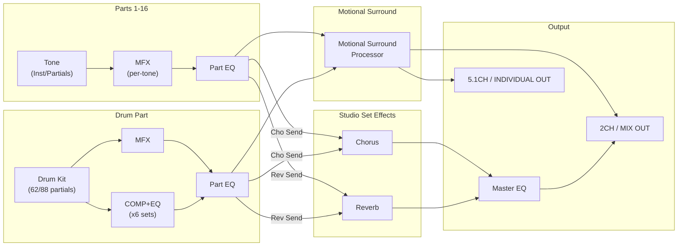
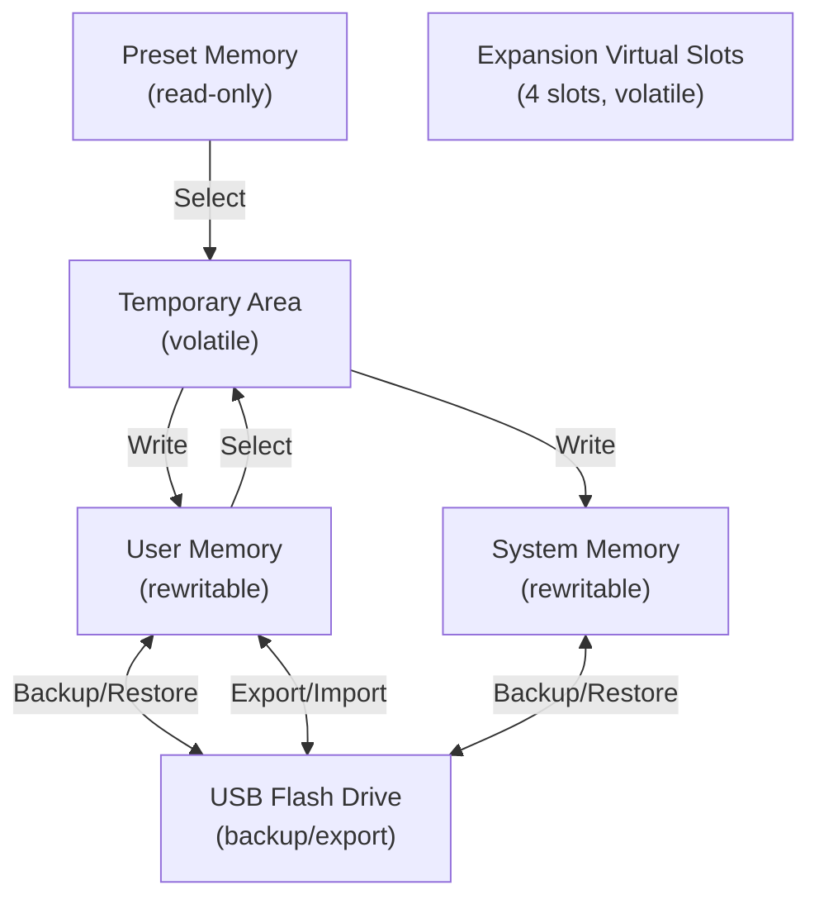

# Architecture and Signal Flow

## Hierarchy Overview

The INTEGRA-7 organizes sound in a three-level hierarchy:

```
Studio Set (top level)
  +-- Part 1..16 (each assigned a tone)
  |     +-- Tone (one of five types)
  |           +-- Partials/Instruments (type-dependent)
  +-- Ext Part (external audio input or USB audio)
```

## Signal Flow

The following diagram shows the complete audio signal path from tone
generation through to output.



**Key constraint:** Motional Surround and Chorus/Reverb are mutually exclusive.
When Motional Surround is ON, Chorus and Reverb are disabled. The signal
bypasses the send effects and routes directly through the surround processor.

## Memory Model



### Memory types

| Memory | Contents | Persistence |
|--------|----------|-------------|
| Temporary Area | Currently active studio set + all tone data for 16 parts | Lost on power-off or studio set change |
| User Memory | Studio sets, all tone types | Persistent, rewritable |
| System Memory | System parameters (tuning, MIDI, display) | Persistent, requires explicit System Write |
| Preset Memory | Factory tones and studio sets | Read-only |
| Expansion Virtual Slots | Loaded expansion sound data (SRX, ExSN, ExPCM) | Volatile, reloaded on startup |
| USB Memory | Backup files, exported sound data (.SVD files) | External storage |

### Important behavior

- Editing always happens in the Temporary Area. You never edit preset or user
  memory directly.
- Expansion sounds edited in the temporary area can be saved to user memory,
  but they will not be audible unless the corresponding expansion data is loaded
  into a virtual slot.
- The INTEGRA-7 can auto-load expansion data into virtual slots on startup
  (configured via Startup Exp Slot A-D system parameters).

## Output Routing

### When Motional Surround is OFF

Each part has an **Output Assign** parameter that routes its direct sound to
one of the output groups:

| Output | Jacks | Volume knob controls? |
|--------|-------|----------------------|
| A (MIX) | L/MONO, R (XLR + TRS) | Yes |
| B | L, R | No |
| C | L, R | No |
| D | L, R | No |
| INDIVIDUAL 1-2 | Mono jacks | 1-2: Yes, 3-8: No |
| INDIVIDUAL 3-8 | Mono jacks | No |

### When Motional Surround is ON

Output Assign is ignored. All sound routes through the surround processor:

| Output | Jacks |
|--------|-------|
| 2CH | A (MIX) L/R |
| 5.1CH L/R | B L/R |
| 5.1CH C | C-L |
| 5.1CH Ls | C-R |
| 5.1CH Rs | D-L |
| 5.1CH LFE | D-R |

Two-channel and 5.1 channel surround are output simultaneously.

## Digital Output

The DIGITAL AUDIO OUT connector (coaxial S/P DIF) outputs the same signal as
OUTPUT A (MIX). Supports 44.1/48/96 kHz, 24-bit linear, stereo.
