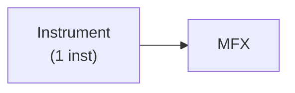
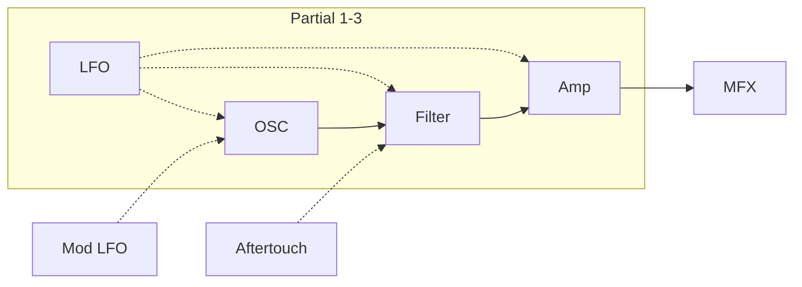
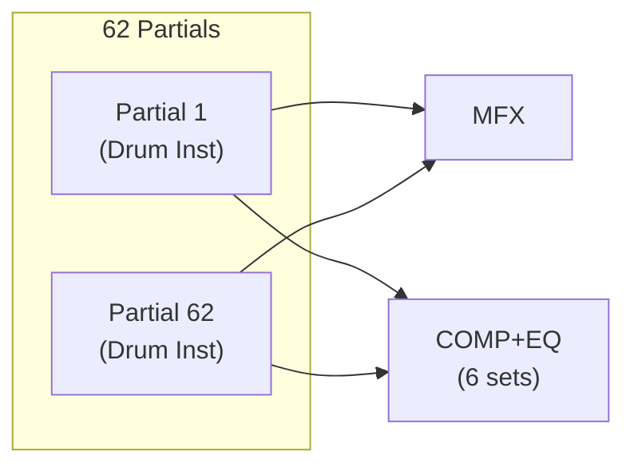
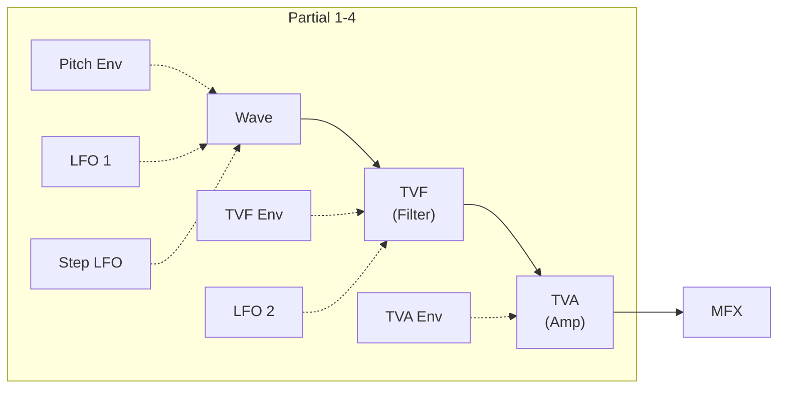
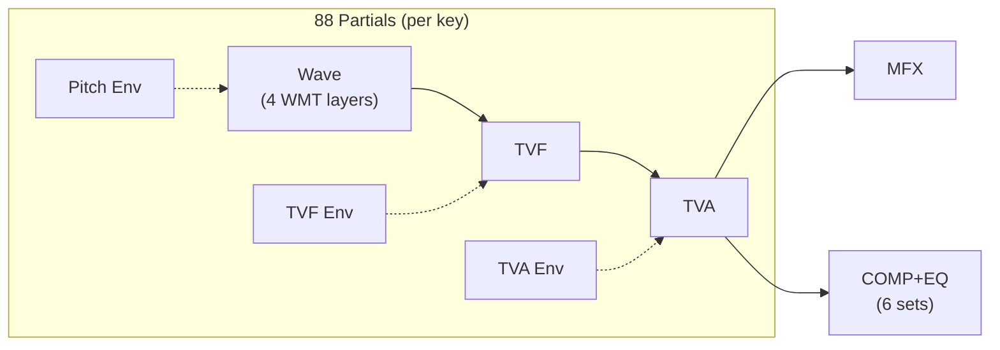

# Tone Types

The INTEGRA-7 has five tone types organized into two families: SuperNATURAL
and PCM. Each tone includes its own MFX (multi-effect) settings.

> **See also:**
> - [Bank Select tables](../midi/03-bank-select-tables.md) — MSB/LSB/PC values for selecting each tone type
> - [MFX type list and parameters](../params/07-mfx-types.md) — all 67 MFX types with per-type parameters

## SuperNATURAL Acoustic Tone (SN-A)

> **Reference docs:**
> - [SN-A SysEx address map](../midi/09-supernatural-acoustic-tone.md) — tone offset `02 00 00` within each part
> - [SN-A parameter descriptions](../params/02-supernatural-acoustic.md) — full instrument list, per-instrument parameters, performance variations
> - Bank Select: MSB `89`, LSB `0-1` (User), `64-65` (Preset), `96-100` (ExSN1-5) — see [bank tables](../midi/03-bank-select-tables.md)

### Key characteristics

- Uses **Behavior Modeling Technology** to simulate instrument-specific behavior,
  not just the sound
- A dedicated sound engine per instrument type analyzes phrases and
  differentiates between chordal and melodic playing
- Each SN-A tone consists of a single "inst" (the smallest sound unit)
- **Dynamics:** Controlled by velocity, CC01 (modulation), and CC11 (expression).
  While a note is sounding, CC01/CC11 can continuously control dynamics
  (except for struck/plucked-string instruments)
- **Legato:** Playing legato (next note-on before previous note-off) produces
  smooth transitions. Requires Mono/Poly=MONO and Legato Switch=ON
- **Variation sounds:** CC80-CC83 (Tone Variation 1-4) instantly switch between
  performance variation sounds per instrument

### Edit structure

| Tab | Description |
|-----|-------------|
| COMMON | Settings that apply to the entire tone |
| INST | Instrument-specific parameters for the assigned instrument |
| MFX | Multi-effect settings |
| MFX CTRL | MIDI control assignments for MFX |

## SuperNATURAL Synth Tone (SN-S)

> **Reference docs:**
> - [SN-S SysEx address map](../midi/08-supernatural-synth-tone.md) — tone offset `01 00 00` within each part
> - [SN-S parameter descriptions](../params/03-supernatural-synth.md) — OSC waveforms, filter modes, LFO, ring mod
> - Bank Select: MSB `95`, LSB `0-3` (User), `64-72` (Preset) — see [bank tables](../midi/03-bank-select-tables.md)

### Key characteristics

- Three partials, each with OSC + Filter + Amp + LFO
- Filters simulate classic analog synth behavior (natural-sounding cutoff/resonance)
- CC74 controls cutoff frequency, CC71 controls resonance
- Additional modulation via Mod LFO, Aftertouch, and Modify parameters
- Over 1,000 preset sounds covering analog to digital synth types

### Edit structure

| Tab | Description |
|-----|-------------|
| COMMON | Global tone settings |
| OSC | Waveform settings |
| PITCH | Pitch settings |
| FILTER | Filter settings |
| AMP | Amplitude settings |
| LFO | LFO modulation |
| MOD LFO | Modulation LFO |
| AFTERTOUCH | Aftertouch response |
| MISC | Envelopes, portamento time control |
| MFX / MFX CTRL | Multi-effect and MIDI control |

## SuperNATURAL Drum Kit (SN-D)

> **Reference docs:**
> - [SN-D SysEx address map](../midi/10-supernatural-drum-kit.md) — tone offset `03 00 00` within each part
> - [SN-D parameter descriptions](../params/04-supernatural-drum.md) — per-key instruments, COMP+EQ, drum inst list
> - Bank Select: MSB `88`, LSB `0` (User), `64` (Preset), `101` (ExSN6) — see [bank tables](../midi/03-bank-select-tables.md)

### Key characteristics

- 62 partials, each assigned a different percussion instrument per key
- **Dynamics:** Natural timbral variation from pianissimo to fortissimo, not
  just volume changes
- **Anti-uniformity:** Attack character differs for each strike to avoid
  monotonous repetition (press rolls, flams, fill-ins sound natural)
- **Ambience control:** Controls resonance between instruments and room ambience
  for the entire kit
- 6 COMP+EQ sets assignable to instrument groups for per-group dynamics and EQ
- COMP+EQ is only available on one designated part (Drum COMP+EQ Assign Part)

### Edit structure

| Tab | Description |
|-----|-------------|
| COMMON | Global kit settings |
| DRUM INST | Per-partial instrument settings (selecting via note-on) |
| COMP | Drum compressor settings |
| EQ | Drum equalizer settings |
| MFX / MFX CTRL | Multi-effect and MIDI control |

## PCM Synth Tone (PCMS)

> **Reference docs:**
> - [PCMS SysEx address map](../midi/06-pcm-synth-tone.md) — tone offset `00 00 00` within each part
> - [PCMS parameter descriptions](../params/05-pcm-synth-tone.md) — wave, PMT, TVF/TVA envelopes, matrix control
> - Bank Select: MSB `87`, LSB `0-1` (User), `64-70` (Preset); MSB `93` (SRX); MSB `97` (ExPCM); MSB `121` (GM2) — see [bank tables](../midi/03-bank-select-tables.md)

### Key characteristics

- Four partials, each independently switchable on/off
- Classic Roland patch architecture (previously called "patches")
- Each partial: Wave + Pitch Env + TVF + TVF Env + TVA + TVA Env + LFO 1/2 + Step LFO
- Partial Mix Table (PMT) controls how partials combine and key range assignments
- Matrix Control (4 slots) for flexible parameter modulation routing
- GM2 and ExPCM bank sounds cannot be edited

### Edit structure

| Tab | Description |
|-----|-------------|
| COMMON | Global tone settings |
| WAVE | Waveform selection |
| PMT | Partial Mix Table (combination, key ranges) |
| PITCH / PITCH ENV | Pitch and pitch envelope |
| TVF / TVF ENV | Filter and filter envelope |
| TVA / TVA ENV | Amplitude and amplitude envelope |
| OUTPUT | Output routing |
| LFO 1 / LFO 2 | LFO modulation |
| STEP LFO | 16-step modulation pattern |
| CTRL | Controller assignments |
| MTRX CTRL 1-4 | Matrix control routing |
| MFX / MFX CTRL | Multi-effect and MIDI control |

## PCM Drum Kit (PCMD)

> **Reference docs:**
> - [PCMD SysEx address map](../midi/07-pcm-drum-kit.md) — tone offset `10 00 00` within each part
> - [PCMD parameter descriptions](../params/06-pcm-drum-kit.md) — per-key waves, WMT layers, COMP+EQ
> - Bank Select: MSB `86`, LSB `0` (User), `64` (Preset); MSB `92` (SRX); MSB `96` (ExPCM); MSB `120` (GM2) — see [bank tables](../midi/03-bank-select-tables.md)

### Key characteristics

- 88 partials (one per key), each with up to 4 WMT (Wave Mix Table) layers
- Previously called "rhythm sets" on older Roland synths
- Per-key: Wave + Pitch Env + TVF + TVF Env + TVA + TVA Env
- 6 COMP+EQ sets assignable to instrument groups
- COMP+EQ only available on the single designated Drum COMP+EQ Assign Part
- GM2 and ExPCM bank sounds cannot be edited

### Edit structure

| Tab | Description |
|-----|-------------|
| COMMON | Global kit settings |
| WAVE | Waveform selection per key |
| WMT | Wave Mix Table (velocity switching between layers) |
| PITCH / PITCH ENV | Pitch and pitch envelope |
| TVF / TVF ENV | Filter and filter envelope |
| TVA / TVA ENV | Amplitude and amplitude envelope |
| OUTPUT | Output routing |
| COMP / EQ | Drum compressor and equalizer |
| MFX / MFX CTRL | Multi-effect and MIDI control |

## Expansion Sounds

### Expansion Virtual Slots

The INTEGRA-7 has 4 virtual slots (A-D) for loading expansion sound data:

| Category | Titles | Tone Types | Slot Usage |
|----------|--------|------------|------------|
| SRX Series | SRX-01 through SRX-12 | PCMS, PCMD | 1 slot each |
| ExSN 1-5 | Ethnic, Woodwinds, Session, A.Guitar, Brass | SN-A only | 1 slot each |
| ExSN 6 | SFX | SN-D only | 1 slot each |
| ExPCM | HQ GM2 + HQ PCM Sound Collection | PCMS, PCMD | All 4 slots |

### SRX Series contents

| Title | Name | PCMS | PCMD |
|-------|------|------|------|
| SRX-01 | Dynamic Drum Kits | 41 | 79 |
| SRX-02 | Concert Piano | 50 | - |
| SRX-03 | Studio SRX | 128 | 12 |
| SRX-04 | Symphonique Strings | 128 | - |
| SRX-05 | Supreme Dance | 312 | 34 |
| SRX-06 | Complete Orchestra | 449 | 5 |
| SRX-07 | Ultimate Keys | 475 | 11 |
| SRX-08 | Platinum Trax | 448 | 21 |
| SRX-09 | World Collection | 414 | 12 |
| SRX-10 | Big Brass Ensemble | 100 | - |
| SRX-11 | Complete Piano | 42 | - |
| SRX-12 | Classic EPs | 50 | - |

### ExSN expansion SuperNATURAL sounds

| Title | Category | Tones |
|-------|----------|-------|
| ExSN1 | Ethnic (kalimba, santur, etc.) | 17 SN-A |
| ExSN2 | Wood Winds (sax, flute, etc.) | 17 SN-A |
| ExSN3 | Session (electric guitar, bass) | 50 SN-A |
| ExSN4 | A. Guitar (acoustic guitar) | 12 SN-A |
| ExSN5 | Brass (trumpet, trombone, etc.) | 12 SN-A |
| ExSN6 | SFX (realistic sound effects) | 7 SN-D |

### ExPCM sounds

- Uses all four virtual slots (cannot coexist with other expansions)
- When loaded, the GM2 bank becomes "GM2#" with high-quality GM2 sounds
- ExPCM tones cannot be edited
- Contains 256 PCMS + 9 PCMD (GM2#) and 512 PCMS + 19 PCMD (ExPCM)

### Startup loading

The INTEGRA-7 can automatically load specified expansion data on startup via
the Startup Exp Slot A-D system parameters. Factory default loads expansion
data automatically.
