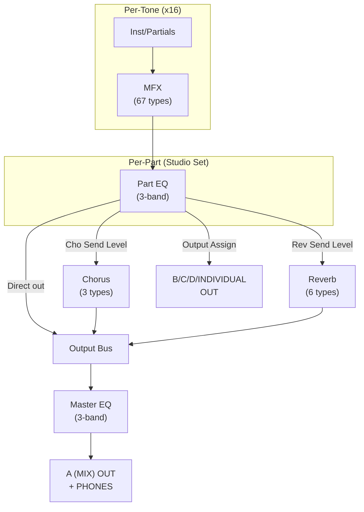

# Effects Routing and Behavior

## Effects Overview

The INTEGRA-7 has six categories of effects, each at a different level of the
signal chain:

| Effect | Level | Count | Purpose |
|--------|-------|-------|---------|
| MFX (Multi-Effect) | Per-tone | 16 systems | General-purpose effect (67 types) |
| Part EQ | Per-part (studio set) | 16 systems | 3-band EQ per part |
| COMP+EQ | Per-drum-kit | 6 sets | Compressor + EQ for drum instrument groups |
| Chorus | Studio set global | 1 system, 3 types | Adds depth and spaciousness |
| Reverb | Studio set global | 1 system, 6 types | Concert hall reverberation |
| Master EQ | Global output | 1 system | Final 3-band EQ on A (MIX) + PHONES |

## Effects Signal Flow

## MFX (Multi-Effect)

- 67 types available, ranging from single effects (distortion, flanger) to
  multi-chains
- Each tone has its own MFX settings -- selecting a tone loads its
  dedicated MFX preset
- All 16 parts can use MFX simultaneously (16 independent MFX processors)
- MFX includes chorus-type effects, but these are independent of the
  studio set chorus unit
- MFX settings are saved as part of the tone (user tone write), not the
  studio set
- MFX can be controlled via MIDI using the MFX CTRL tab (per-tone)

## Part EQ (Equalizer)

- Applied to each individual part
- 3-band: Low, Mid, High
- Each band has Frequency and Gain parameters
- Mid band also has Q (bandwidth) control
- Can be switched on/off per part via EQ Switch
- Settings are saved as part of the studio set

## COMP+EQ (Drum Compressor + Equalizer)

- 6 independent compressor + equalizer sets per drum kit
- Each drum instrument can be assigned to one of the 6 COMP+EQ sets
- Allows grouping instruments (e.g., all cymbals, all toms) for unified
  dynamics/EQ processing
- Only available on **one** designated part: the Drum COMP+EQ Assign Part
  (set in Studio Set Common GENERAL tab)
- Although drum kits can be assigned to any/all parts, only the designated
  part gets the COMP+EQ processing
- COMP+EQ output routing is saved as studio set parameters

## Chorus

- Adds depth and spaciousness to the sound
- 3 types available
- Controlled per-part via **Cho Send Level** (set to 0 to bypass)
- **Not available when Motional Surround is ON**

## Reverb

- Simulates concert hall reverberation
- 6 types available
- Controlled per-part via **Rev Send Level** (set to 0 to bypass)
- **Not available when Motional Surround is ON**

## Master EQ

- Applied to the overall sound output (A (MIX) jacks and PHONES jack)
- 3-band: Low, Mid, High
- Final stage of the audio chain before output
- Does not affect B/C/D or INDIVIDUAL 3-8 outputs

## Motional Surround Interaction

Motional Surround and Chorus/Reverb are **mutually exclusive**:

| Motional Surround | Chorus | Reverb | Pan |
|-------------------|--------|--------|-----|
| OFF | Available | Available | L/R pan works |
| ON | Disabled | Disabled | Ignored (use L-R/F-B positioning) |

When turning Motional Surround ON:
- Chorus and Reverb are automatically turned off
- Part Pan settings are ignored
- Output Assign is ignored (all routing goes through surround processor)
- The surround processor provides its own ambience (replacing reverb)

The EFFECTS ROUTING screen shows a different layout depending on whether
Motional Surround is on or off.

## Effects On/Off Control

All effects can be individually toggled on/off from the EFFECTS ROUTING screen
(accessed via the [EFFECTS] button). This screen provides a visual overview
of the entire effects chain and allows quick enable/disable of each stage.

## Stereo Effects Note

Since the INTEGRA-7's internal effects are stereo, applying an insert effect
will cause effect sound to be heard from the opposite side even if the source
sound is panned all the way to one side. This is normal behavior.
