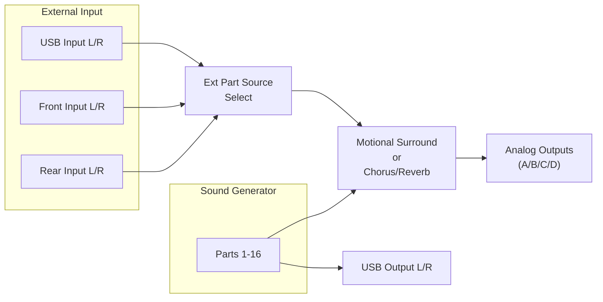
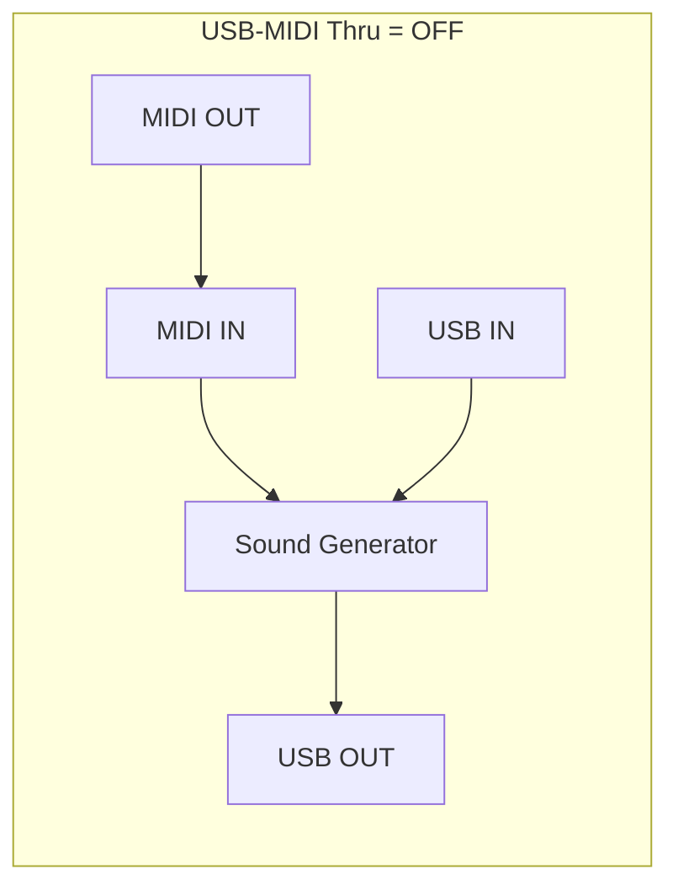
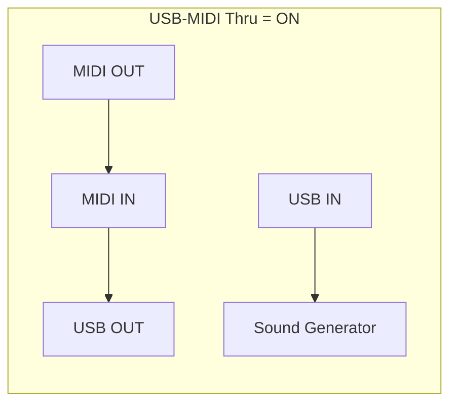

# Operational Details

## Tone Preview

The [VOLUME] knob doubles as a preview trigger when pressed:

### Preview modes

| Mode | Behavior |
|------|----------|
| SINGLE | Notes specified by Preview 1-4 Note Number play one at a time |
| CHORD | Notes specified by Preview 1-4 Note Number play simultaneously |
| PHRASE | A built-in phrase appropriate for the tone's category plays |

### Preview parameters (System)

- Preview 1-4 Note Number (C-1 to G9)
- Preview 1-4 Velocity (OFF, 1-127)
- Hold [SHIFT] + press [VOLUME] for continuous preview playback;
  press again to stop

## Tone Selection

### By Category (Tone Finder)

The [TONE FINDER] button opens a category-organized tone list. Use cursor
buttons to switch categories, value dial to browse within a category.

### By Type/Bank

The [SuperNATURAL] and [PCM] buttons open type-organized tone lists with
tabs for each bank (Preset, User, SRX-01..12, ExSN1..6, ExPCM, GM2).

### Drum Kit selection

Drum kits have separate tabs: "SN Drum Kit" for SuperNATURAL, "PCM Drum Kit"
for PCM.

## Part Management

### Mute

Toggle individual part muting from the top screen. A bar above the part
number disappears when muted.

### Solo

Solo the current part to hear it in isolation. Switching parts while solo is
active changes which part is soloed.

## USB Audio

### Audio Signal Flow

### Audio format

| Parameter | Value |
|-----------|-------|
| Sampling Rate | 44.1, 48, or 96 kHz (must match DAW) |
| Bit Depth | 24-bit (fixed) |
| Channels | 2 (stereo) |

### USB driver modes

| Driver | MIDI | Audio | Platform |
|--------|------|-------|----------|
| VENDER | Yes | Yes | Requires Roland driver installation |
| GENERIC | Yes | No | Uses OS built-in driver |

The driver setting requires a System Write and power cycle to take effect.

### USB Audio routing

- **INTEGRA-7 to computer:** Same signal as A (MIX) output is sent via USB
- **Computer to INTEGRA-7:** Sound from the computer plays through the
  INTEGRA-7's output jacks. If Motional Surround is on, computer audio
  can also be positioned in the surround field via the Ext Part.

## MIDI Signal Flow

### USB-MIDI Thru modes

When USB-MIDI Thru is ON:
- MIDI IN messages pass through to USB OUT (computer) without sounding
  the internal generator
- USB IN messages play the sound generator
- The INTEGRA-7 acts as a MIDI interface

When USB-MIDI Thru is OFF:
- MIDI IN messages play the sound generator directly
- No pass-through to USB

## Bulk Dump

The BULK DUMP utility transmits the entire Temporary Area (current studio set
and tone settings) as SysEx data to an external MIDI device. Use cases:
- Cloning settings to another INTEGRA-7
- Saving settings to a DAW/sequencer as a precaution

## Synchronization

| Parameter | Options | Description |
|-----------|---------|-------------|
| Sync Mode | MASTER, SLAVE | MASTER for standalone, SLAVE to follow external clock |
| Clock Source | MIDI, USB | Where to receive clock in SLAVE mode |
| System Tempo | 20-250 BPM | Ignored in SLAVE mode |
| Tempo Assign Source | SYSTEM, STUDIO SET | Whether tempo follows system or per-studio-set value |

## Studio Set Control Channel

A dedicated MIDI channel (1-16 or OFF) for switching studio sets via
Program Change and Bank Select from an external device.

## System Control

Up to 4 MIDI messages can be assigned as system-wide controls affecting
volume, tone, etc. across all parts. Options: CC01-95, Pitch Bend, Aftertouch.

Control Source Select determines whether system-level or studio-set-level
tone controls are used.

## GM2 Mode

The INTEGRA-7 can receive GM System On and GM2 System On messages
(configurable via Rx GM System On / Rx GM2 System On). When ExPCM is
loaded, the GM2 bank upgrades to "GM2#" with higher-quality sounds.

## Data Management

### Export/Import (.SVD files)

- Export selected studio sets and/or tones to USB flash drive
- Exporting a studio set automatically includes its referenced tones
- Files saved as `*.SVD` under `/ROLAND/SOUND/` on the USB drive
- Import allows selecting individual items from an SVD file
- Import destinations default to slots named "INIT STUDIO", "INIT TONE",
  "INIT KIT" (avoid saving important data with these names)

### Backup/Restore

- Backup saves ALL settings (user memory + system memory) as a single file
- Restore overwrites all current settings
- Backup files stored under `/ROLAND/BACKUP/` on the USB drive
- Requires power cycle after restore

### Factory Reset

Restores all settings to factory state. All user data is lost. Requires
power cycle after reset.

## Auto Off

The INTEGRA-7 automatically powers down after inactivity:

| Setting | Behavior |
|---------|----------|
| OFF | Never auto-off |
| 30 min | Powers off after 30 minutes of inactivity |
| 240 min (default) | Powers off after 4 hours of inactivity |

After Auto Off, wait at least 10 seconds before powering on again.

## Startup Behavior

- **Startup Studio Set:** Load a specific studio set or "LAST-SET" (most
  recently selected) on power-on
- **Startup Exp Slot A-D:** Specify which expansion data loads into each
  virtual slot on power-on (OFF or a specific title)
- Hold [EXIT] during startup to skip expansion loading
- Hold [MENU] during startup to reset LCD settings
